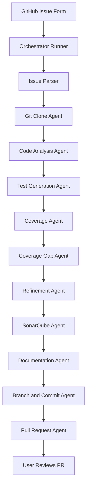

# Agents.md

## Objective
Define an agentic workflow that:
1. Accepts a repository URL at runtime from a GitHub Issue form
2. Clones the selected GitHub repository
3. Generates NUnit test cases for the codebase
4. Runs Coverlet-based test coverage and generates `coverage.opencover.xml`
5. Analyzes the code with SonarQube available at `http://localhost:9000/projects` using the `SONAR_TOKEN` environment variable when enabled
6. Creates inline code documentation when enabled
7. Pushes generated changes to a branch
8. Creates a Pull Request for user review and approval

---

## Runtime Inputs
- `repository_url`
- `branch`
- `target_coverage`
- `run_sonar`
- `add_docs`
- `issue_number`
- `issue_url`

---

## Agentic Workflow Overview

---

## Core Principles
- Keep execution stepwise and auditable
- Validate each step before moving to the next
- Use runtime inputs instead of hardcoded repository values
- Prefer deterministic execution for build, test, coverage, Sonar, branch creation, and PR creation
- Enforce a runtime-configured minimum overall test coverage target
- Default the coverage target to 30% when not explicitly provided
- If coverage is below the configured target, iterate test generation and coverage improvement up to 3 refinement cycles
- Require user approval through Pull Request review

---

## Agents

### 1. Issue Parser Agent
**Responsibility**
- Parse GitHub Issue form input
- Validate required fields
- Build runtime execution configuration

**Outputs**
- Parsed workflow configuration object

---

### 2. Git Clone Agent
**Responsibility**
- Clone the repository from `repository_url`
- Checkout the requested `branch`
- Validate that the repository is readable

---

### 3. Code Analysis Agent
**Responsibility**
- Detect `.sln`, `.csproj`, services, controllers, repositories, DTOs, and current testability points

---

### 4. Test Generation Agent
**Responsibility**
- Create or update NUnit tests
- Focus on business logic, branches, repository behavior, and controller outcomes
- Produce an initial candidate test set for downstream validation and refinement
- Allow later iterations to target specific low-covered classes instead of repeating only broad generation
- Use LLM-assisted targeted generation for selected service and controller classes when available, with deterministic guardrails and fallback behavior

---

### 5. Coverage Agent
**Responsibility**
- Run Coverlet in OpenCover format
- Generate `coverage.opencover.xml`
- Evaluate the runtime-configured minimum coverage threshold

**Expected command style**
- `dotnet test /p:CollectCoverage=true /p:CoverletOutput=TestResults/coverage /p:CoverletOutputFormat=opencover`

---

### 6. Coverage Gap Agent
**Responsibility**
- Parse `coverage.opencover.xml`
- Identify the lowest-covered classes and methods
- Filter out synthetic compiler-generated targets such as async state machine types
- Produce a refinement target list for the next iteration

**Outputs**
- Coverage gap summary
- Ranked uncovered or low-covered classes
- Ranked uncovered or low-covered methods
- Filtered refinement target list focused on real source classes

---

### 7. Refinement Agent
**Responsibility**
- Use build results, test results, and coverage gap findings to guide the next iteration
- Prefer targeted regeneration over broad repeated smoke-test generation
- Preserve successful generated files when possible and focus effort on low-covered areas
- Prioritize service and controller classes when they dominate the uncovered business logic
- Permit LLM-assisted refinement for targeted classes while retaining validation, rejection, and heuristic fallback safeguards

---

### 8. SonarQube Agent
**Responsibility**
- Run SonarQube analysis when `run_sonar` is enabled
- Use `SONAR_TOKEN`
- Import `coverage.opencover.xml`

---

### 9. Documentation Agent
**Responsibility**
- Add inline XML documentation when `add_docs` is enabled

---

### 10. Branch and Commit Agent
**Responsibility**
- Create a working branch for generated changes
- Commit generated output
- Push branch to remote

**Suggested branch format**
- `agent/issue-{issue_number}`

---

### 11. Pull Request Agent
**Responsibility**
- Open a Pull Request against the requested branch
- Reference the originating issue
- Ask the user to review and approve

---

## Execution Sequence

1. Parse issue input
2. Clone selected repository
3. Analyze codebase
4. Generate or update NUnit tests
5. Run Coverlet and create `coverage.opencover.xml`
6. Parse coverage gaps and identify the lowest-covered classes and methods
7. If coverage is below the configured target, refine and retry up to 3 iterations
8. Run SonarQube if enabled
9. Add inline documentation if enabled
10. Create branch, commit, and push
11. Create Pull Request for review

---

## Success Criteria
The workflow is successful only if:
- The selected repository is cloned successfully
- NUnit tests are generated or updated
- `coverage.opencover.xml` is generated
- Coverage gaps are summarized for refinement when the target is not yet met
- The configured target coverage is achieved within 3 iterations
- SonarQube analysis runs when enabled
- Documentation is added when enabled
- A Pull Request is created for review

---

## Failure Handling
If any phase fails:
- Stop downstream execution
- Report the failing phase
- Comment failure details back to the triggering GitHub Issue
- Preserve logs for review